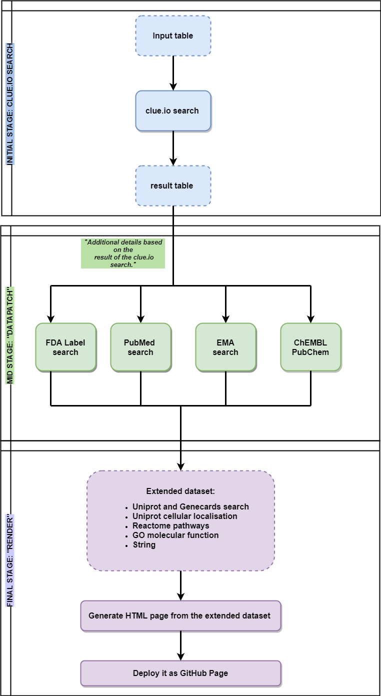

# Construction and Content

## Input Spreadsheet

_NOTE: This section describes input spreadsheet hosted on Google Drive._
_Self-hosted runs use_ `target_list.tsv` _located in_ `data` _directory._

Each entry obtained from the search results in the interactive online
platform of `EZCancerTarget` is referenced and has at least one scientific
piece of evidence. Figure \@ref(fig:flowchart) shows a flowchart on
the processing steps and workflow of `EZCancerTarget`.

(ref:flowchart) Flowchart of functionality describes the main steps of `EZCancerTarget`’s functionality, including data input, _clue.io_ target search, cross-referencing in databases (Datapatch) and molecular background information on selected targets (Render).

```{r flowchart, fig.cap='(ref:flowchart)', echo=FALSE, out.width='90%', fig.align='center'}

```


First, users of
`EZCancerTarget` can start their workflow by opening the project's starting page on
_GitHub_ (https://cycle20.github.io/EZCancerTarget/). Then, users can upload their target
list with three pieces of information into a _Google Spreadsheet_
([Target INPUT](https://docs.google.com/spreadsheets/d/1oQtWxPJASB-WfwqnyBJr3woXmv03bu3iSzIrKyK2-t8/)).

(ref:molecular-targets) Input table of targets - Users can enter selected targets’ _HUGO_ name (black rectangle), _label_ (blue dashed rectangle) and _UniProt_ ID (green dashed rectangle) in columns `A`, `B` and `C`. Hitting _"Start Rendering"_ will initiate the _clue.io_ search (red arrowhead). Progress can be traced by clicking on hyperlink in cells `H6-K6` (black arrow). Clicking on the hyperlink in cell `F2-I2` reveals the results page.

```{r input-table, fig.cap='(ref:molecular-targets)', echo=FALSE, out.width='90%', fig.align='center'}
knitr::include_graphics("images/Figure_2_NEW.jpg")
```

The first piece (Fig. \@ref(fig:input-table) Column A), asks for the _HUGO ID_.
In _Column B_, users can give a _"Label"_ for every target for classification and
clustering useful in later work.
The third piece (Fig. \@ref(fig:input-table) column C) is the _UniProtKB ID_ of
the searched gene. Inputs for the `HUGO` and `Label` columns are limited to
12 characters. On the right side of the spreadsheet (columns `E-K`), hyperlinks
provide access to the results page on _GitHub_, and
in the _"Results of Update Request"_ box, users can check the query's status.
Hitting the _"Start Rendering"_ button located on columns `E-F` starts the query.
The area within `E1-K8` are protected and automatically overwritten if edited
(Fig. \@ref(fig:input-table)).

## Result Page

By clicking on the _"Result page"_ link on the target spreadsheet, we can access
the results of our query within approximately 10 minutes. Clicking on
the hyperlink in cell `H6` we can follow the progress of the query
(Fig. \@ref(fig:input-table), arrow). A new query overwrites the earlier one in
the web application, but every previous version is saved on _GitHub_ under the
_"Result of Update Request"_ link
(https://github.com/cycle20/EZCancerTarget/actions/workflows/clue.yml).
A scrollable panel displays all the targets on the left with at least one valid
drug compound available. The software automatically excludes entries where no
drug or small molecule inhibitor/agonist is available according to the _clue.io_
repurposing hub. 


In the first entry of the results list (_"Summary"_) the evaluation report
on the search is accessible. In the _"Overview"_ section, it displays the total
number of found compounds for all listed targets and the average number of
compounds per target. The amount of found compounds are classified according to
their pre- and clinical phase as well. In the _"Molecular Background"_ section
details from the retrieved molecular background data is evaluated according to
the number of found _Reactome_ or _KEGG_ pathways, _STRING_ interactors and
_GO_ molecular functions, subcellular localizations, biological processes.
Finally ("Compound" section), every listed target is separately detailed of
their compound entries in _PubMed_, _PubChem_, _ChEMBL_ and _DrugBank_.


The platform creates a table for every target, where different columns indicate
the mechanism of action (_MoA_), clinical status (_preclinical_, _phase 1_,
_phase 2_, _phase 3_, or _launched_), and the search resources from _PubMed_,
_EMA_ and the direct entry from _clue.io_. Furthermore, the query table includes
hyperlinks with _DrugBank_, _PubChem_, and _ChEMBL_ IDs to quickly access
the compounds' chemical and pharmacological properties (Fig. \@ref(fig:drugs)).

(ref:targets-and-drugs) Targets and drugs - Clicking on the labels of selected targets (column on left side) unveils available compound list (black box) describing also _mechanism of action_ (MoA, dashed box), _clinical status_ (red box), _resources_ of information on _PubMed_ (green box) and _DrugBank_/_PubChem_/_ChEMBL_ entries (blue box).

```{r drugs, fig.cap='(ref:targets-and-drugs)', echo=FALSE, out.width='90%', fig.align='center'}
knitr::include_graphics("images/Figure_3.jpg")
```


`EZCancerTarget` also gives a comprehensive, highly structured overview of the
selected targets regarding their molecular biology data,
including molecular function (_Gene Ontology_), their connectome (_STRING_),
participation in pathways, and cellular localization (_Reactome_ and _KEGG_)
retrieved from various databases. Hyperlinks to _GeneCards_ and
_DrugBank Target Search_ are also available but differently structured as for
_UniProt_ entries. The _"STRING"_ entry opens a static _STRING_ map for
the target and provides a hyperlink to https://string-db.org/ (Fig. \@ref(fig:molecular-background)).

(ref:molecular-bg) Molecular background of druggable targets - _Details on the molecular background of druggable targets:_ _Panel A_ shows the network map from _STRING_ with static string map and hyperlink to STRING DB entry. _Panel B_ displays hyperlinks to _"molecular function"_, _"biological processes"_ and _"subcellular localisation"_ to browse the _UniProt_ database on molecular background. By clicking directly on the titles, we can access a specific function. _Panel C_ shows hyperlinks to visualize _KEGG_ and _Reactome_ pathways of the selected target. For Reactome, clicking on individual pathway titles we can directly access the infographic of the given pathway.

```{r molecular-background, fig.cap='(ref:molecular-bg)', echo=FALSE, out.width='90%', fig.align='center'}
knitr::include_graphics("images/Figure_4_NEW.jpg")
```


The following entry carries the _"Molecular Functions / Subcellular Localizations"_
title, where the two main hyperlinks (source) lead to _UniProt_'s _"Function"_ and
_"Subcellular Localization"_ pages. Molecular function entries and target
localizations are also provided as text separately, where hyperlinks lead to
the _QuickGO_ platform to obtain further information about relevant
compartment-specific molecular pathways (Fig. \@ref(fig:molecular-background)).
The last entry named _"Pathways"_ provides links to every _Reactome_ database,
where the target's participation is visualized in every relevant metabolic pathway
(Fig. \@ref(fig:molecular-background)). The hyperlink to
the entry of the _KEGG_ database is also displayed here, without being broken down
to individual links to pathways. **Supplementary Video 1** shows a short tutorial
about the functionality of the program and the main steps to generate a query.

