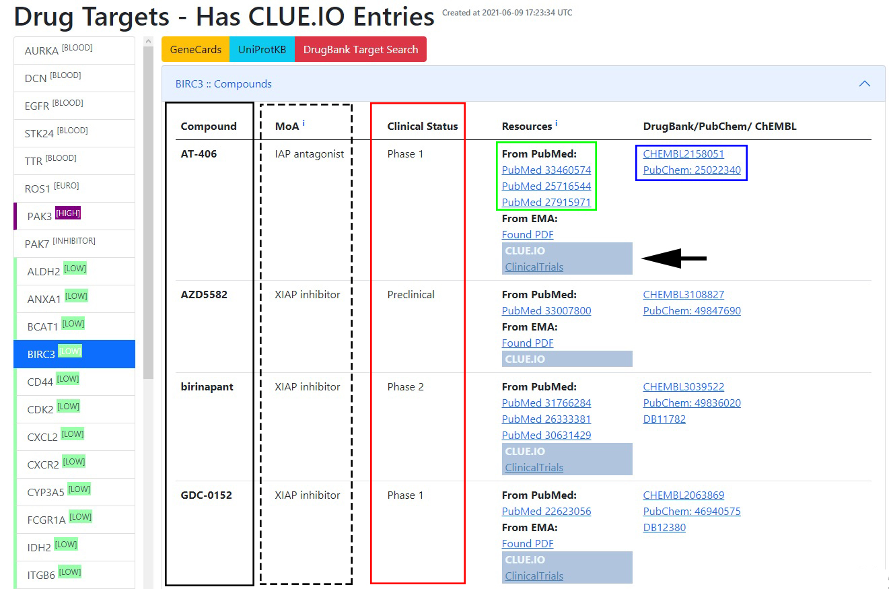

# Figures and Legends


## Flowchart of functionality

Flowchart describes the main steps of `EZCancerTarget`’s functionality,
including data input, _clue.io_ target search, cross-referencing in databases
(Datapatch) and molecular background information on selected targets (Render).

```{r flowchart, fig.cap='Flowchart of functionality', echo=FALSE, out.width='90%', fig.align='center'}
knitr::include_graphics("images/Figure_1.jpg")
```


## Input table for molecular targets

Users can enter selected targets’ _HUGO_ name (black rectangle),
_label_ (blue dashed rectangle) and _UniProt_ ID (green dashed rectangle) in
columns `A`, `B` and `C`. Hitting _"Start Rendering"_ will initiate the _clue.io_
search (red arrowhead). Progress can be traced by clicking on hyperlink in cells
`H6-K6` (black arrow). Clicking on the hyperlink in cell `F2-I2` reveals
the results page.

```{r input-table, fig.cap='Input table of targets', echo=FALSE, out.width='90%', fig.align='center'}
knitr::include_graphics("images/Figure_2_NEW.jpg")
```


## List of drug targets

Clicking on the labels of selected targets (column on left side) unveils
available compound list (black box) describing also _mechanism of action_
(MoA, dashed box), _clinical status_ (red box), _resources_ of information on
_PubMed_ (green box) and _DrugBank_/_PubChem_/_ChEMBL_ entries (blue box).

```{r drugs, fig.cap='Targets and drugs', echo=FALSE, out.width='90%', fig.align='center'}

```


## Molecular background of druggable targets

_Details on the molecular background of druggable targets:_ _Panel A_ shows the
network map from _STRING_ with static string map and hyperlink to STRING DB entry.
_Panel B_ displays hyperlinks to _"molecular function"_, _"biological processes"_ and
_"subcellular localisation"_ to browse the _UniProt_ database on molecular background.
By clicking directly on the titles, we can access a specific function.
_Panel C_ shows hyperlinks to visualize _KEGG_ and _Reactome_ pathways of the
selected target. For Reactome, clicking on individual pathway titles we can
directly access the infographic of the given pathway.

```{r molecular-background, fig.cap='Molecular background', echo=FALSE, out.width='90%', fig.align='center'}
knitr::include_graphics("images/Figure_4_NEW.jpg")
```
